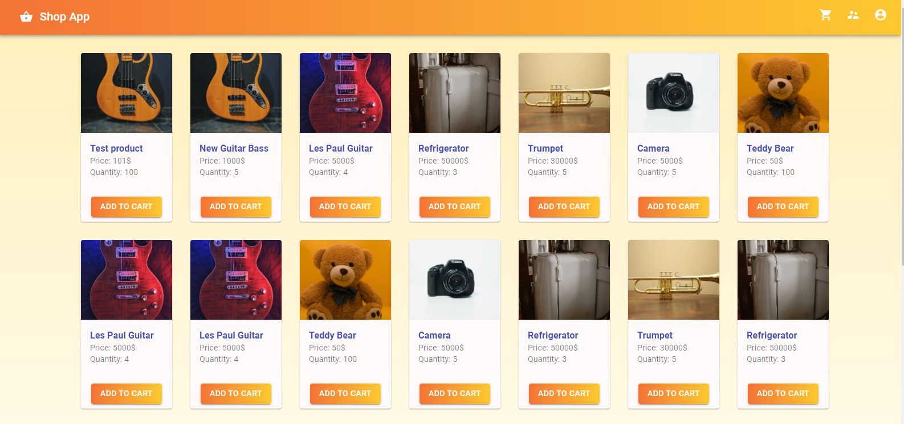

# Shop App

A page replicated a shopping app which fetch data from a real backend server. You can go and buy your favorite product!

### Links

- You can view the page live here: (#URL)

## Table of contents

- [Overview](#overview)
  - [The challenge](#the-challenge)
  - [Screenshot](#screenshot)
- [My process](#my-process)
  - [Built with](#built-with)
  - [What I learned](#what-i-learned)
- [Author](#author)

## Overview

### The challenge

Users should be able to:

- Click on to copy the color HEX, RGB or RGBA code.
- Modify the brightness of each color
- Create a brand new color of their own, drag and drop any color they like and name them.

### Screenshot



## My process

### Built with

- Semantic HTML5 markup
- CSS custom properties
- Flexbox
- Javascript
- Axios
- REACTJS
- REDUX
- MATERIAL UI
- JSS

### What I learned

```js
export const loginUser = createAsyncThunk<
  Response,
  InputUser,
  { rejectValue: ValidationErrors }
>("user/login", async (user, { rejectWithValue }) => {
  try {
    const response = await ProductDataService.loginUser(user);
    API.defaults.headers.common = { Authorization: response.data.token };
    return response.data;
  } catch (err: any) {
    let error: AxiosError<ValidationErrors> = err;
    if (!error.response) {
      throw err;
    }
    console.log(error.response.data);
    return rejectWithValue(error.response.data);
  }
});
```

### Continued development

I will continue to develop this app. It does not have a lot of functionality as of now. I'd like to add categories and search bar for people to find the products more easily.

## Author

- Frontend Mentor - [@manhtran1611](https://www.frontendmentor.io/profile/manhtran1611)
- Git hub - [@manhtran1611](https://github.com/manhtran1611)
